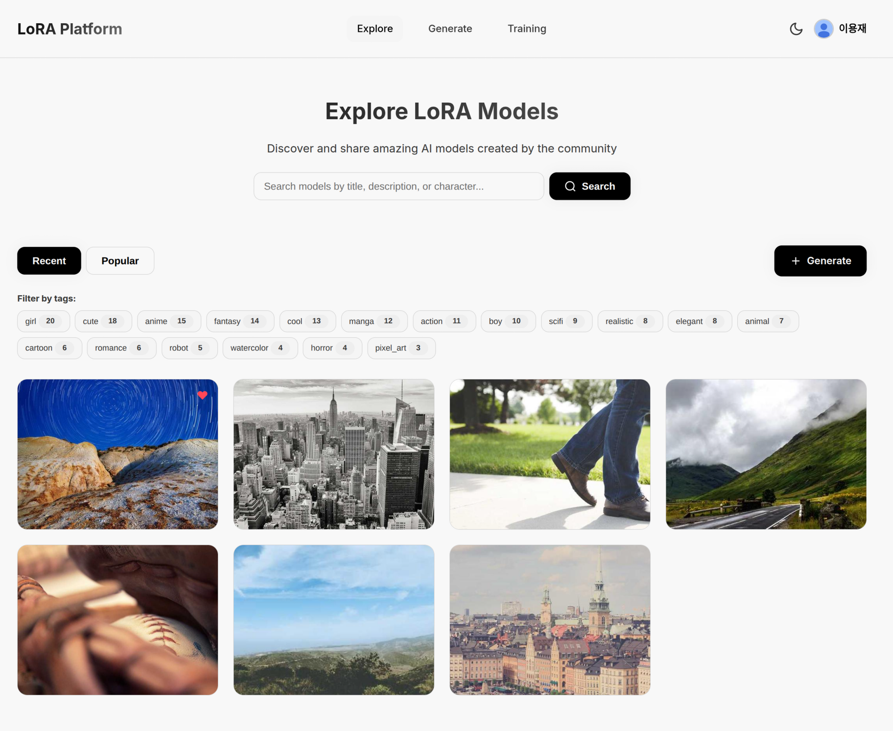

# LoRA Platform UI - 개발 문서

## 프로젝트 개요

OpenAPI 명세(json.json)를 기반으로 한 LoRA 모델 공유 플랫폼 웹 UI입니다.

### 기술 스택
- **Frontend**: Vue 3 (Composition API)
- **언어**: TypeScript
- **라우터**: Vue Router 4
- **스타일**: Vanilla CSS (Utility-first)
- **API**: REST API + Server-Sent Events (SSE)

### 서버 구성
- **Spring Boot API**: `http://localhost:8080`
- **FastAPI ML 서버**: `http://127.0.0.1:8000` (학습/생성)

---

## 개발 환경 설정

### 1. 의존성 설치
```bash
npm install
```

### 2. 개발 서버 실행
```bash
npm run dev
```

### 3. 빌드
```bash
npm run build
```

---

## 프로젝트 구조

```
lora_UI/
├── src/
│   ├── assets/
│   │   └── main.css          # 모노톤 블랙/화이트 유틸리티 CSS
│   ├── components/
│   │   ├── Navigation.vue    # 네비게이션 바 (인증, 사용자 메뉴)
│   │   └── ModelCard.vue     # 모델 카드 컴포넌트
│   ├── views/
│   │   ├── ModelList.vue     # 모델 목록 (최신순/인기순, 태그 필터)
│   │   ├── ModelDetail.vue   # 모델 상세 (샘플, 프롬프트, 댓글)
│   │   ├── Generate.vue      # 이미지 생성 (SSE 실시간 진행률)
│   │   ├── Training.vue      # LoRA 학습 (SSE 실시간 진행률)
│   │   ├── Search.vue        # 통합 검색
│   │   ├── Profile.vue       # 프로필/내 모델
│   │   └── Login.vue         # 로그인
│   ├── services/
│   │   └── api.ts            # REST API 클라이언트 + JWT 인증
│   ├── router/
│   │   └── index.ts          # Vue Router 설정
│   ├── App.vue               # 루트 컴포넌트
│   └── main.ts               # 엔트리 포인트
├── json.json                  # OpenAPI 3.0 명세
├── choan.png                  # 실행 화면 스크린샷
└── README.md                  # 프로젝트 문서
```

---

## 디자인 시스템

### 컬러 팔레트 (Monochrome Black & White)
```css
/* 주요 색상 */
--primary: #ffffff;           /* 흰색 */
--bg-dark: #000000;           /* 검정 배경 */
--bg-card: #0a0a0a;           /* 카드 배경 */
--bg-hover: #1a1a1a;          /* 호버 상태 */
--border: #2a2a2a;            /* 테두리 */

/* 텍스트 */
--text-primary: #ffffff;      /* 주요 텍스트 */
--text-secondary: #b0b0b0;    /* 보조 텍스트 */
--text-muted: #707070;        /* 약한 텍스트 */
```

### CSS 유틸리티 클래스

#### Layout
- `container`, `container-sm`: 컨테이너
- `flex`, `flex-col`: Flexbox
- `grid`, `grid-cols-{1-4}`: Grid
- `gap-{xs,sm,md,lg,xl}`: 간격

#### Typography
- `text-{xs,sm,base,lg,xl,2xl,3xl,4xl}`: 폰트 크기
- `font-{normal,medium,semibold,bold}`: 폰트 굵기
- `text-{primary,secondary,muted}`: 텍스트 색상

#### Components
- `card`, `card-sm`: 카드
- `btn`, `btn-primary`, `btn-secondary`, `btn-ghost`: 버튼
- `input`, `textarea`: 입력 필드
- `badge`, `tag`: 뱃지, 태그

---

## API 클라이언트 구조

### 1. 인증 (JWT)
```typescript
// 로그인
api.auth.googleLogin()

// 토큰 관리
authStore.setTokens(accessToken, refreshToken)
authStore.getAccessToken()
authStore.isAuthenticated()
authStore.clearTokens()
```

### 2. 모델
```typescript
// 목록 조회
api.models.getPublicModels(page, size)
api.models.getPopularModels(page, size)
api.models.getMyModels(page, size)

// 상세 조회
api.models.getModelDetail(modelId)

// 검색/필터
api.models.searchModels(query, page, size)
api.models.filterByTags(tags, page, size)
```

### 3. 생성 (Generation)
```typescript
// 이미지 생성
await api.generation.generateImage({
  modelId, prompt, negativePrompt,
  steps, guidanceScale, seed
})

// SSE 실시간 진행률
const eventSource = api.generation.streamGenerationProgress((data) => {
  if (data.status === 'IN_PROGRESS') {
    // 진행률 업데이트
  } else if (data.status === 'SUCCESS') {
    // 완료, 이미지 표시
  }
})
```

### 4. 학습 (Training)
```typescript
// 1. 모델 생성
const modelResponse = await api.training.createModel({
  title, description, characterName, style,
  trainingImagesCount, epochs, learningRate,
  loraRank, baseModel, isPublic
})

// 2. 트레이닝 작업 생성
const jobResponse = await api.training.createTrainingJob(modelId)

// 3. 트레이닝 시작
await api.training.startTraining(jobId, config)

// 4. SSE 실시간 진행률
const eventSource = api.training.streamTrainingProgress((data) => {
  if (data.status === 'TRAINING') {
    // 진행률 업데이트 (currentEpoch, totalEpochs, phase)
  }
})

// 트레이닝 목록 조회
api.training.getMyTrainingJobs()
```

### 5. 커뮤니티
```typescript
// 좋아요/즐겨찾기
api.community.toggleLike(modelId)
api.community.toggleFavorite(modelId)

// 댓글
api.community.getComments(modelId, page, size)
api.community.createComment(modelId, content, parentCommentId?)
```

---

## 주요 페이지

### 1. ModelList (/)
- 최신순/인기순 탭
- 태그 필터링
- 페이지네이션
- 실시간 API 호출

### 2. ModelDetail (/models/:id)
- 모델 정보 (제목, 설명, 작성자, 태그)
- 통계 (좋아요, 조회수, 즐겨찾기)
- 샘플 이미지 그리드
- 프롬프트 예제 (복사 기능)
- 댓글 시스템

### 3. Generate (/generate)
- 완료된 내 모델 선택
- 프롬프트 입력 (positive/negative)
- 파라미터 조절 (steps, guidance scale, seed)
- SSE 실시간 진행률 (currentStep / totalSteps)
- 생성된 이미지 다운로드

### 4. Training (/training)
**Left: 설정**
- 모델 정보 (title, description, characterName, style)
- 데이터셋 정보 (trainingImagesCount, isPublic)
- 하이퍼파라미터 (learningRate, epochs, loraRank, baseModel)
- Start/Cancel 버튼
- SSE 실시간 진행률 (currentEpoch / totalEpochs)

**Right: 히스토리**
- 내 트레이닝 작업 목록
- 상태 뱃지 (TRAINING, COMPLETED, FAILED)
- 진행 정보 (phase, epoch progress)
- View Model / Delete 버튼

### 5. Search (/search)
- 통합 검색 (모델, 태그)
- 실시간 검색 결과

---

## 개발 히스토리

### Phase 1: 기본 구조 (2024)
1. OpenAPI 스펙(json.json) 분석
2. main.css 작성 (모노톤 블랙/화이트 디자인)
3. 기본 컴포넌트 생성 (Navigation, ModelCard)
4. 페이지 뷰 생성 (ModelList, ModelDetail, Login, Profile, Search)

### Phase 2: API 연동
1. api.ts 작성 (전체 REST API 클라이언트)
2. JWT 인증 구현 (authStore)
3. ModelList, ModelDetail API 연동
4. Navigation 인증 연동

### Phase 3: 라우팅
1. vue-router 설치
2. router/index.ts 작성
3. App.vue에 RouterView 적용
4. 모든 `<a href>` → `<router-link to>` 변경

### Phase 4: Generate & Training 재작성
1. Generate.vue 완전 재작성
   - 모노톤 디자인 적용
   - 2컬럼 레이아웃 (설정 | 결과)
   - SSE 실시간 진행률
   - 이미지 다운로드

2. Training.vue 완전 재작성
   - OpenAPI 스펙에 정확히 맞춤
   - 3단계 API 호출 (createModel → createTrainingJob → startTraining)
   - SSE 실시간 진행률
   - 트레이닝 히스토리

### Phase 5: Google OAuth 통합 및 UI 개선 ✅
1. **Google OAuth 로그인 통합**
   - AuthCallback.vue 생성: OAuth2 콜백 처리, URL Fragment에서 토큰 추출
   - api.ts에 `googleLogin()` 메서드 추가
   - Login.vue에서 백엔드 OAuth 엔드포인트 호출
   - 로그인 후 자동으로 홈(/)으로 리다이렉트 (페이지 새로고침)

2. **Navigation 컴포넌트 개선**
   - 로그인 상태에 따라 "Login with Google" 버튼 또는 사용자 프로필 표시
   - 사용자 아바타 + 닉네임 표시
   - 드롭다운 메뉴: Profile, My Models, Favorites, Logout
   - 모바일 햄버거 메뉴 추가
   - 모바일에서 Search 탭 제거, 닉네임 텍스트 숨김 (아바타만 표시)

3. **프로필 자동 갱신**
   - Profile.vue: 프로필 수정 시 CustomEvent (`profile-updated`) 발생
   - Navigation.vue: `profile-updated` 이벤트 수신하여 실시간 닉네임/아바타 갱신
   - 새로고침 없이 Navigation 바 자동 업데이트

4. **Search 기능 통합**
   - Search 탭 제거, Explore 페이지에 검색 기능 통합
   - ModelList.vue에 검색창 추가 (Hero 섹션)
   - 검색어 입력 시 `api.search.searchModels()` 호출
   - 검색 중에는 Recent/Popular 탭 숨김
   - Clear 버튼으로 검색 초기화
   - 모바일 반응형 검색 UI

5. **모바일 UX 개선**
   - 모바일 메뉴: Explore, Generate, Training만 표시
   - "Create Model" 버튼 → "Generate" 버튼으로 변경
   - 모바일에서 검색창 세로 레이아웃 (버튼 전체 너비)

6. **Navigation 구조 개선**
   - Desktop: Explore, Generate, Training (3개 탭)
   - Mobile: 햄버거 메뉴로 모든 네비게이션 제공
   - 로그인 사용자: Profile, My Models, Favorites 메뉴 추가

---

## 실행 화면



---

## 주요 기능

### 인증
- ✅ Google OAuth 2.0 로그인
- ✅ JWT 토큰 자동 갱신
- ✅ LocalStorage 토큰 저장
- ✅ 인증 상태 관리

### 모델 관리
- ✅ 공개 모델 목록 (최신순/인기순)
- ✅ 내 모델 목록
- ✅ 모델 상세 조회
- ✅ 태그 기반 필터링
- ✅ 검색 기능

### 이미지 생성
- ✅ LoRA 모델 선택
- ✅ 프롬프트 입력
- ✅ 파라미터 조절
- ✅ SSE 실시간 진행률
- ✅ 이미지 다운로드

### LoRA 학습
- ✅ 모델 생성 (메타데이터 + 하이퍼파라미터)
- ✅ 트레이닝 작업 생성 및 시작
- ✅ SSE 실시간 진행률 (epoch, phase)
- ✅ 트레이닝 히스토리 관리
- ✅ 트레이닝 취소

### 커뮤니티
- ✅ 좋아요/즐겨찾기
- ✅ 댓글 시스템
- ✅ 샘플 이미지 갤러리
- ✅ 프롬프트 예제 (복사 기능)

---

## 트러블슈팅

### 1. 모든 페이지가 같은 컴포넌트를 표시
**문제**: vue-router가 설치되지 않아 라우팅이 작동하지 않음
**해결**: `npm install vue-router@4` 후 router 설정 추가

### 2. API 호출 실패 (CORS)
**문제**: Spring Boot 서버에서 CORS 설정 필요
**해결**: 서버에 CORS 허용 설정 추가

### 3. SSE 연결 끊김
**문제**: EventSource가 제대로 닫히지 않음
**해결**: `onUnmounted`에서 `eventSource.close()` 호출

---

## TODO

- [v] 파일 업로드 기능 (이미지)
- [ ] 무한 스크롤 페이지네이션
- [v] 다크/라이트 모드 토글
- [v] 모바일 반응형 개선
- [ ] 에러 토스트 알림
- [ ] 로딩 스켈레톤 UI

---

## 참고 자료

- [Vue 3 공식 문서](https://vuejs.org/)
- [Vue Router 공식 문서](https://router.vuejs.org/)
- [OpenAPI 3.0 스펙](https://swagger.io/specification/)
- [Server-Sent Events (SSE)](https://developer.mozilla.org/en-US/docs/Web/API/Server-sent_events)
